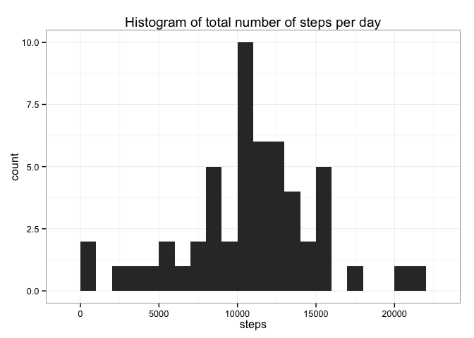
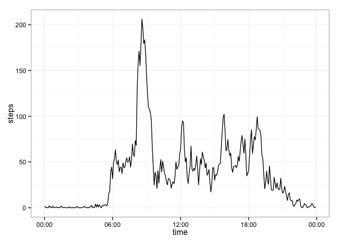
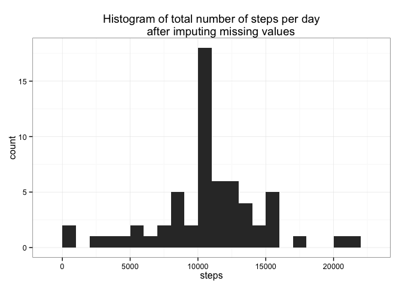
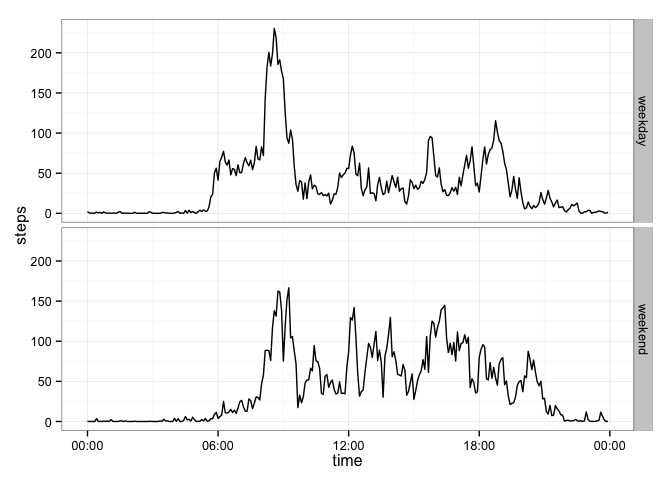

# Reproducible Research: Peer Assessment 1


## Loading and preprocessing the data  
The data in the column corresponding to "interval" are clearly meant to be times. For example, the integers 0-55 refer to 00:00 - 00:55 hours (12:00-12:55 AM), the integers 100-155 refer to 01:00 - 01:55 hours (1:00 - 1:55 AM), etc. The only way I know to get these numbers to be interpreted correctly as times is to first pad them with the appropriate number of zeros so that they are all four-digit numbers, so I wrote a function "pad_time" to do this. If someone knows of an easier way, please let me know in your comments!


```r
library(dplyr);library(ggplot2);library(lubridate);library(scales)
```

```
## 
## Attaching package: 'dplyr'
## 
## The following object is masked from 'package:stats':
## 
##     filter
## 
## The following objects are masked from 'package:base':
## 
##     intersect, setdiff, setequal, union
```

```r
activity = read.csv('activity.csv', 
                    colClasses = c("numeric","character","character"))
pad_time = function(string)
{
  numToPad = 4 - nchar(string)
  if (numToPad > 0)
    {
      for (x in 1:numToPad)
        {
          string = paste("0",string,sep="")
        }
    }
  return (string)
}
activity$interval = as.character(lapply(activity$interval, pad_time))
activity = tbl_df(activity)
```

## What is mean total number of steps taken per day?  

```r
# Calculate total number of steps taken per day
step_total <-
  activity %>%
  filter(!is.na(steps)) %>%
  group_by(date) %>%
  summarize(steps=sum(steps))
# Plot histogram
qplot(steps,data=step_total, binwidth = 1000,
      main="Histogram of total number of steps per day") + theme_bw()
```

 

```r
# Mean and median
mean(step_total$steps)
```

```
## [1] 10766.19
```

```r
median(step_total$steps)
```

```
## [1] 10765
```
The mean and median number of total steps taken per day were 10,766 and 10,765, respectively (rounding to nearest whole step).

## What is the average daily activity pattern?  

```r
step_mean <-
  activity %>%
  filter(!is.na(steps)) %>%
  group_by(interval) %>%
  summarize(steps=mean(steps)) %>%
  mutate(time=parse_date_time(interval,'hm'))
qplot(time,steps,data=step_mean,geom='line') + 
  scale_x_datetime(labels=date_format("%H:%M")) + theme_bw()
```

 

```r
step_mean[which.max(step_mean$steps),]
```

```
## Source: local data frame [1 x 3]
## 
##   interval    steps                time
## 1     0835 206.1698 0000-01-01 08:35:00
```

On average, the maximum number of steps (206) were taken in the five-minute interval beginning at 8:35.

## Imputing missing values


```r
sum(is.na(activity$steps))
```

```
## [1] 2304
```

There were a total number of 2304 missing values. My strategy for dealing with missing values will be to fill in any missing interval with the mean for that interval, from the step_mean table created above.


```r
# Impute missing values
for (x in 1:nrow(activity))
  {
    if (is.na(activity$steps[x]))
      {
        activity$steps[x] = 
          step_mean$steps[step_mean$interval == activity$interval[x]]
      }
  }
# Calculate new total number of steps taken per day
step_total <-
  activity %>%
  group_by(date) %>%
  summarize(steps=sum(steps))
# Plot histogram
qplot(steps,data=step_total, binwidth = 1000,
      main="Histogram of total number of steps per day
      after imputing missing values") + theme_bw()
```

 

```r
# Mean and median
mean(step_total$steps)
```

```
## [1] 10766.19
```

```r
median(step_total$steps)
```

```
## [1] 10766.19
```

After imputing missing values in this way, the mean and median total number of steps are equivalent and equal to 10,766 (rounding to nearest whole step). The mean is the same as before, and the median has changed by 1 step. Since we imputed using the original mean from all days, the mean number of steps has remained the same. The main impact of this imputation is to create a steeper central peak in the distribution. 

## Are there differences in activity patterns between weekdays and weekends?


```r
activity$date = as.Date(activity$date)
step_mean <-
  activity %>%
  mutate(dayOfWeek = weekdays(date), 
         day = ifelse(dayOfWeek %in% c('Saturday','Sunday'),
                      'weekend','weekday')) %>%
  group_by(interval,day) %>%
  summarize(steps=mean(steps)) %>%
  mutate(time=parse_date_time(interval,'hm'))
qplot(time,steps,data=step_mean,geom='line',facets=day~.) + 
  scale_x_datetime(labels=date_format("%H:%M")) + theme_bw()
```

 
